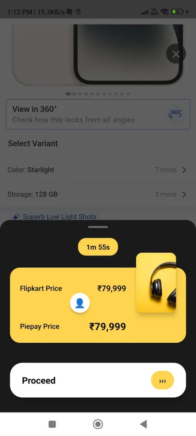
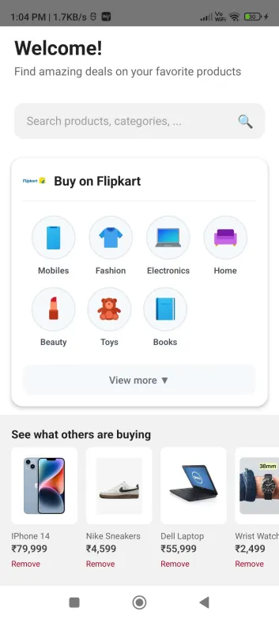
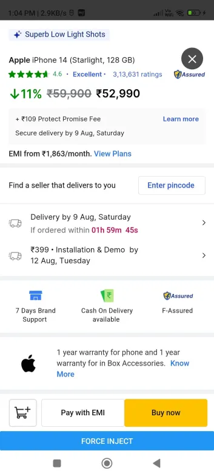
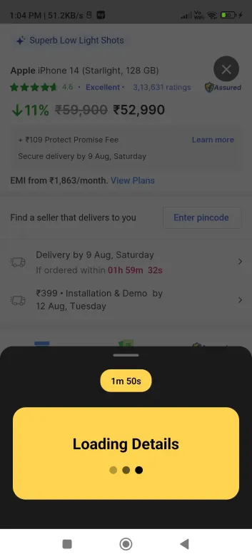

This is a new [**React Native**](https://reactnative.dev) project, bootstrapped using [`@react-native-community/cli`](https://github.com/react-native-community/cli).

# Getting Started

> **Note:** The project is configured for **Yarn**. Please use `yarn` commands instead of `npm`.

<table>
  <tr>
    <td></td>
    <td></td>
  </tr>
  <tr>
    <td></td>
    <td></td>
  </tr>
</table>

## Step 1: Install dependencies

Run the following command once to install all project packages:

```sh
yarn install
```

## Step 2: Run Server

Run the following command to run server:

```sh
cd src/api/
yarn install
yarn run dev
or

cd ..
yarn server
```

## Step 3: Start Metro

First, you will need to run **Metro**, the JavaScript build tool for React Native.

To start the Metro dev server, run the following command from the root of your React Native project:

```sh
yarn start
```

## Step 4: Build and run your app

With Metro running, open a new terminal window/pane from the root of your React Native project, and use one of the following commands to build and run your Android or iOS app:

### Android

```sh
yarn android
```


## API Testing

### Price Scraping API

The application provides a REST API endpoint for scraping product prices from Flipkart.

#### Endpoint: `POST /api/prices`

**Test 1: Scraping by URL only**
```bash
curl -X POST http://localhost:3001/api/prices \
  -H "Content-Type: application/json" \
  -d '{
    "flipkartUrl": "https://www.flipkart.com/apple-iphone-14-starlight-128-gb/p/itm3485a56f6e676"
  }'
```

**Response:**
```json
{
  "success": true,
  "productTitle": "apple_iphone_14_sta",
  "originalTitle": "Apple iPhone 14 (Sta"
}
```

**Test 2: Scraping with custom product details**
```bash
curl -X POST http://localhost:3001/api/prices \
  -H "Content-Type: application/json" \
  -d '{
    "productTitle": "Apple iPhone 14",
    "wowDealPrice": "₹64,999",
    "flipkartUrl": "https://www.flipkart.com/apple-iphone-14-starlight-128-gb/p/itm3485a56f6e676"
  }'
```

**Response:**
```json
{
  "success": true,
  "productTitle": "apple_iphone_14_sta",
  "originalTitle": "Apple iPhone 14 (Sta",
  "wowDealPrice": "₹64,999"
}
```

### Known Issues

⚠️ **WowDeal Price Scraping Issue**: 
- The wow deal price can be fetched successfully when using direct API scraping
- However, it returns `null` when fetched through injected JavaScript in the browser extension
- Currently, the application displays Flipkart prices only due to this limitation